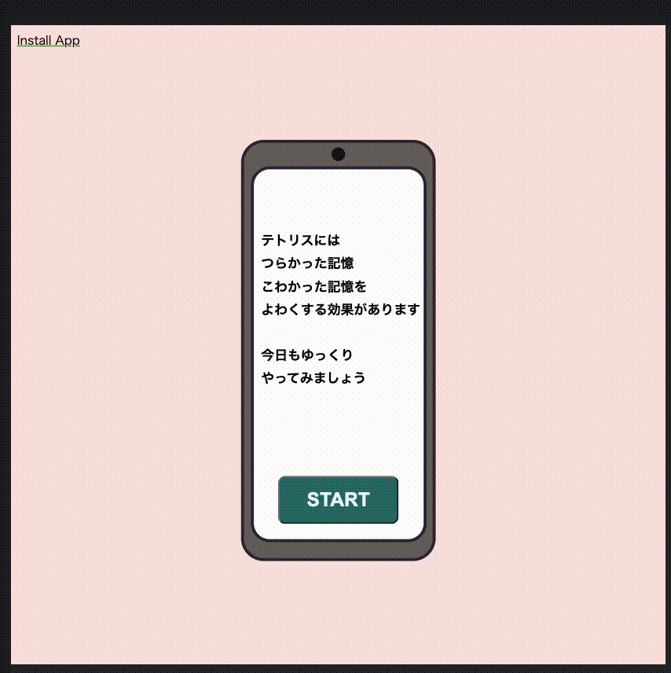
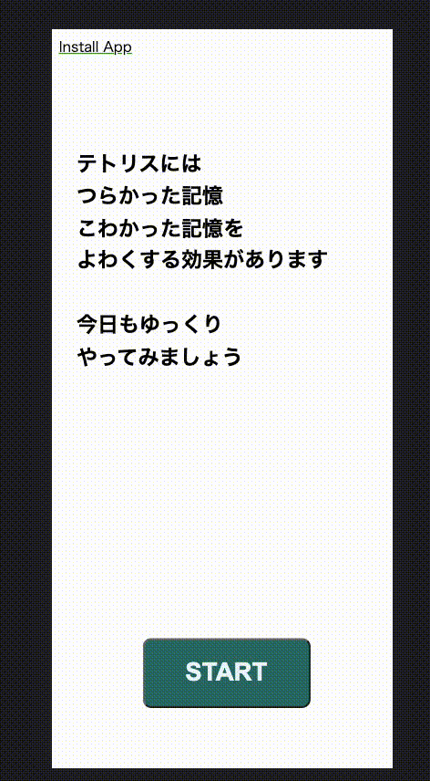

# tetris

## どんなApp?

シンプルなテトリス。
[つらい記憶のフラッシュバックは「テトリス」をやると減る](https://natgeo.nikkeibp.co.jp/atcl/news/23/092100485/?ST=m_news)という研究結果が出たという記事を見て作成。

スマートフォンで気軽に操作できるようにPWAに。

効果的なプレイの方法として、紹介した記事で

>最初に、被験者はとりわけ悪い記憶のかけらを思い出すよう求められる。

とあるので、最初のページで「テトリスにはつらかった記憶　こわかった記憶を　よわくする効果があります」と記載。
「つらかった記憶　こわかった記憶」という言葉でプレイヤーの記憶のかけらを引き出してから、テトリス画面へ遷移する。

**現在、すべてのブラウザが PWA をサポートしているわけではありません。Chrome、FireFox、Edgeの最新バージョンが対応しています。**

## 画面

### ブラウザ

### SmartPhone

## Tech Stach

- HTML
- CSS
- JavaScript

## 参考URL
[Your Static Site to a PWA!](https://dev.to/prorishi/your-static-site-to-a-pwa-24dl)

テトリスの作り方
https://www.youtube.com/playlist?list=PLa3BDwShqOrThKoaWauNo8EKZda4pat7Z

ブラウザ対応UI参考Codepen
https://codepen.io/vaishak10/embed/JjNVymL?